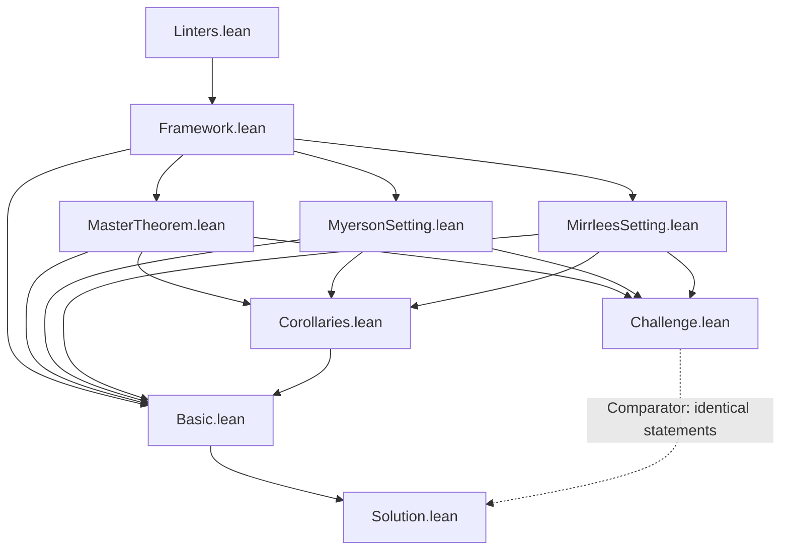
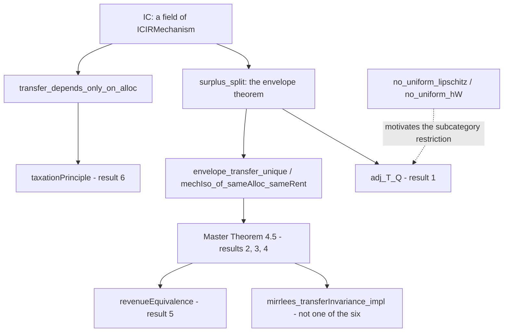
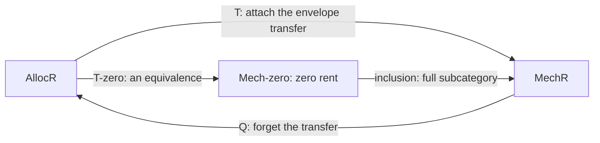

# MechDesigAdjointfunctor

A Lean 4 / Mathlib formalization of the **categorical unification of Myerson's
Revenue Equivalence Theorem and the Mirrlees Taxation Principle** as instances of
a single Master Theorem about the adjunction `T ⊣ Q` between a category of
allocation rules and a category of incentive-compatible mechanisms.

- **Namespace:** `MechDesign`
- **Toolchain:** `leanprover/lean4:v4.30.0`
- **Mathlib:** pinned at `c5ea00351c28e24afc9f0f84379aa41082b1188f` (see `lakefile.toml` / `lake-manifest.json`)
- **Permitted axioms:** `propext`, `Quot.sound`, `Classical.choice`
- **License:** Apache-2.0

This repository follows the [Palomar](https://palomar-registry.org/) submission
layout: a small human-auditable statement surface (`Challenge.lean`), a proof
surface with identical signatures (`Solution.lean`), and the full development in
`MechDesigAdjointfunctor/`. `comparator.json` names the six declarations that
Comparator checks are stated identically in both surfaces and proved with only
the permitted axioms.

---

## Repository structure

```
MechDesigAdjointfunctor.lean            root module, re-exports MechDesigAdjointfunctor.Basic
MechDesigAdjointfunctor/
├── Basic.lean                          re-exports the whole development
└── Lean/
    ├── Linters.lean                    @[needs_witness] / @[witness_for] attributes
    ├── Framework.lean                  Stages 1–3: mechanisms, the two thin categories,
    │                                   the elementary taxation principle
    ├── MyersonSetting.lean             auction environment: v(a,θ) = θ·a
    ├── MirrleesSetting.lean            taxation environment: v(y,θ) = θ·h(y) − g(y/θ)
    ├── MasterTheorem.lean              Stage 4: envelope theorem, regular subcategories,
    │                                   T ⊣ Q, the three parts of the Master Theorem
    └── Corollaries.lean                Revenue Equivalence and the Mirrlees instance,
                                        vacuity theorems, the posted-price witness

Challenge.lean                          6 advertised statements, each with `sorry`
Solution.lean                           same 6 signatures, each delegated to a `_impl`
comparator.json                         declarations Comparator must match
formalization.yaml                      registry metadata
scripts/                                verify-comparator.sh, validate-formalization.rb, landrun-wrapper.sh
docbuild/                               nested doc-gen4 project
```

---

## Module dependency graph

Solid arrows are Lean `import` edges within this development; every module also
imports Mathlib. `Challenge.lean` deliberately imports only the *setting*
modules, not `Corollaries`, keeping the audited surface small.



**Layering, bottom to top**

| Layer | Module(s) | What it adds |
|---|---|---|
| Attributes | `Linters` | the linter machinery that makes `adj_T_Q`'s witness obligation load-bearing |
| Stages 1–3 | `Framework` | `Mechanism`, `ICIRMechanism` (IC + IR), `surplus`, the thin categories **Mech** / **Alloc**, and `taxationPrinciple_impl` — which needs **only IC** |
| Environments | `MyersonSetting`, `MirrleesSetting` | the two value functions and their calculus facts; both allocation spaces are `ℝ` |
| Stage 4 | `MasterTheorem` | the envelope theorem (`surplus_split`), the *regular* subcategories `AllocR` / `MechR` / `Mech₀`, the adjunction `TR ⊣ QR`, and Master Theorem 4.5 (i)–(iii) |
| Corollaries | `Corollaries` | `revenueEquivalence_impl` and `mirrlees_transferInvariance_impl` (one call, two value functions), plus `no_uniform_lipschitz` / `no_uniform_hW` and the posted-price witness object |

---

## The six advertised results

All six are stated in [`Challenge.lean`](Challenge.lean) with full docstrings and
a `sorry`, and re-proved in [`Solution.lean`](Solution.lean) by delegating to the
corresponding `*_impl` declaration.

| # | Declaration | Kind | Source | `_impl` |
|---|---|---|---|---|
| 1 | `MechDesign.adj_T_Q` | `def` | Theorem 4.3 | `MasterTheorem.adj_T_Q_impl` |
| 2 | `MechDesign.masterTheorem_existence` | `theorem` | Theorem 4.5(i) | `MasterTheorem.masterTheorem_existence_impl` |
| 3 | `MechDesign.masterTheorem_isomorphism` | `theorem` | Theorem 4.5(ii) | `MasterTheorem.masterTheorem_isomorphism_impl` |
| 4 | `MechDesign.masterTheorem_transferInvariance` | `theorem` | Theorem 4.5(iii) | `MasterTheorem.masterTheorem_transferInvariance_impl` |
| 5 | `MechDesign.revenueEquivalence` | `theorem` | Myerson (1981) | `Corollaries.revenueEquivalence_impl` |
| 6 | `MechDesign.taxationPrinciple` | `theorem` | Mirrlees (1971); Hammond (1979); Rochet (1985) | `Framework.taxationPrinciple_impl` |

### How the results depend on each other



- `IC` alone gives `transfer_depends_only_on_alloc`, hence `taxationPrinciple`
  (result 6): one mechanism, a tax schedule `T` with `t = T ∘ q`.
- `IC` plus the envelope theorem `surplus_split` gives Master Theorem 4.5
  (results 2–4), and `revenueEquivalence` (result 5) is its Myerson instance;
  `mirrlees_transferInvariance_impl` is the same call in the Mirrlees setting.
- `adj_T_Q` (result 1) is `TR ⊣ QR` on the regular subcategories `AllocR` /
  `MechR`; `no_uniform_lipschitz` and `no_uniform_hW` are why it must be stated
  there rather than on all of **Mech**.

**Reading the graph**

- **The taxation principle ⟨6⟩ is cheap.** It quantifies over *one* mechanism and
  uses nothing but incentive compatibility: `transfer_depends_only_on_alloc`
  applies IC at two types with the same allocation, in both directions, and the
  transfers are pinned. No single crossing, no differentiability, no measure, no
  `θ_min > 0`. It is general in the allocation type `A`, so the same theorem
  posts a price list against winning probabilities in the auction setting.

- **Revenue equivalence ⟨5⟩ is expensive.** It quantifies over *two* mechanisms
  with the same allocation rule and the same boundary rent, and concludes they
  agree everywhere on `[θ_min, ∞)`. Its content is the envelope theorem
  `surplus_split` (Milgrom–Segal: MVT + squeeze), the whole of Stage 4.

- **The genuine unification** is between revenue equivalence *in the auction
  setting* and *in the taxation setting*: `revenueEquivalence_impl` and
  `mirrlees_transferInvariance_impl` are the **same call** to
  `masterTheorem_transferInvariance_impl`, differing only in the value function
  `v` and the term witnessing that `v` is differentiable in the type. Both
  allocation spaces are literally `ℝ`.

- **The adjunction ⟨1⟩ is structure, not a lemma the corollaries consume.**
  Neither ⟨5⟩ nor ⟨6⟩ uses `adj_T_Q`; the categorical fact they do use is that an
  iso in **MechR** forces equal transfers. `adj_T_Q` is stated on the *regular*
  subcategories `AllocR` / `MechR` rather than all of **Mech** because
  `no_uniform_lipschitz` and `no_uniform_hW` prove that the envelope-theorem
  hypotheses, if quantified over every object of **Mech**, cannot all be
  satisfied — the statement would be vacuous. `Corollaries.myersonAdjunction`
  instantiates it and `Corollaries.postedPriceObj` supplies an object, so the
  statement has content.

### The categorical picture

Three thin categories and two functors, all in `MasterTheorem.lean`:

- **`AllocR`** — regular monotone allocation rules; one morphism `r ⟶ r'` iff `r.q ≤ r'.q` pointwise.
- **`MechR`** — regular BIC-IR mechanisms; `m ⟶ m'` iff `q ≤ q'` and `V_m ≤ V_{m'}` on `[θ_min, ∞)`.
- **`Mech₀`** — the full subcategory of `MechR` on the zero-rent objects.



`T ⊣ Q` (`adj_T_Q`) is a **coreflection**: the unit `η_r : r ⟶ Q(T r)` is the
identity (`Q ∘ T = 1` on the nose, by structure eta on `MonotoneAlloc`), so `T`
is fully faithful. The counit `ε_m : T(Q m) ⟶ m` strips the rent, and
`isIso_counit_iff_zeroRent` proves it is invertible **exactly** when
`V_m(θ_min) = 0`. Corestricted to zero rent, `T` becomes an equivalence
`equivAllocMech₀ : AllocR ≌ Mech₀` — a normalised mechanism *is* its allocation
rule. That equivalence is the taxation principle at full strength; the elementary
`taxationPrinciple` ⟨6⟩ is its shadow inside a single object.

### The taxation principle and revenue equivalence are not the same relation

Both results are an instance of one slogan — *the transfer is the allocation plus
a constant* — but categorically they are two different factorization statements,
about two different diagrams, at two different prices. The word "fiber" refers to
two different maps.

| | quantifies over | categorical content | cost |
|---|---|---|---|
| **Taxation principle** (elementary, ⟨6⟩) | the fibers of the allocation map `q`, **inside one mechanism** | `t` is constant on those fibers, so it coequalizes the kernel pair of `q` restricted to `[θ_min, ∞)` and factors through the epi part of `q`'s epi–mono factorization — `taxSchedule` is that induced map on the image | IC only |
| **Revenue equivalence** (⟨5⟩) | the fiber of the **functor** `Q` over a fixed `r`, **across objects** | that fiber is a one-parameter family indexed by the boundary rent, with `T(r)` initial in it (`T_initial`, `envelope_transfer_shift`); equal rent means isomorphic (`mechIso_of_sameAlloc_sameRent`), and an iso in a thin category forces equal transfers | IC **+ the envelope theorem**, i.e. all of Stage 4 |

Neither corollary consumes the adjunction `adj_T_Q`. The shared categorical
ingredient is only `transfer_eq_of_iso` — that an iso in **MechR** equalizes
transfers — which is a fact about the hom-sets, not about `T ⊣ Q`.

The machinery does collapse the two in one place: the equivalence
`AllocR ≌ Mech₀`. On *normalised* mechanisms `Q` is not merely faithful but
invertible, and that is the taxation principle "at full strength" — but it is the
elementary factorization **plus** the whole envelope layer, so it costs what
revenue equivalence costs, not what the elementary taxation principle costs. Two
theorems share the name at very different prices.

The one relation that *is* an identity is between revenue equivalence in the
**auction** setting and in the **taxation** setting: `revenueEquivalence_impl` and
`mirrlees_transferInvariance_impl` are the same call to
`masterTheorem_transferInvariance_impl`, differing only in the value function.

---

## Building and verifying

```bash
lake exe cache get
lake build                       # builds MechDesigAdjointfunctor, Challenge, Solution
lake build Challenge Solution    # just the audited surfaces

ruby scripts/validate-formalization.rb   # rejects leftover TEMPLATE sentinels
./scripts/verify-comparator.sh           # pinned Comparator + lean4export + NanoDa under Landrun
```

`verify-comparator.sh` requires Linux with Git, Go, Ruby, Rust/Cargo, Python 3
and a working Landrun sandbox. `enable_nanoda: true` in `comparator.json` turns
on the independent NanoDa replay of the export.

Optional documentation build:

```bash
(cd docbuild && lake build MechDesigAdjointfunctor:docs)
```

---

## Submission

1. Commit the tree; take the full 40-character SHA.
2. Update `formalization.yaml` (`review.status`, reviewers) if the review state has changed.
3. Open <https://submit.palomar-registry.org/> and enter the SHA.

Submit only as a responsible author/maintainer of the formalization, or with
their approval.

---

## References

- R. B. Myerson, *Optimal Auction Design*, Mathematics of Operations Research 6(1):58–73, 1981. [DOI:10.1287/moor.6.1.58](https://doi.org/10.1287/moor.6.1.58)
- J. A. Mirrlees, *An Exploration in the Theory of Optimum Income Taxation*, Review of Economic Studies 38(2):175–208, 1971. [DOI:10.2307/2296777](https://doi.org/10.2307/2296777)
- S. Mac Lane, *Categories for the Working Mathematician*, Springer-Verlag, 1978.
